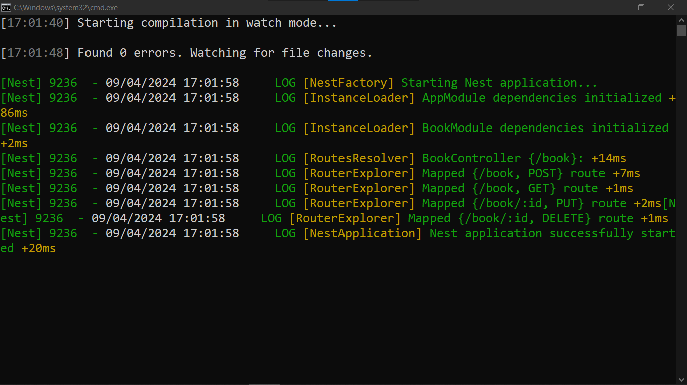
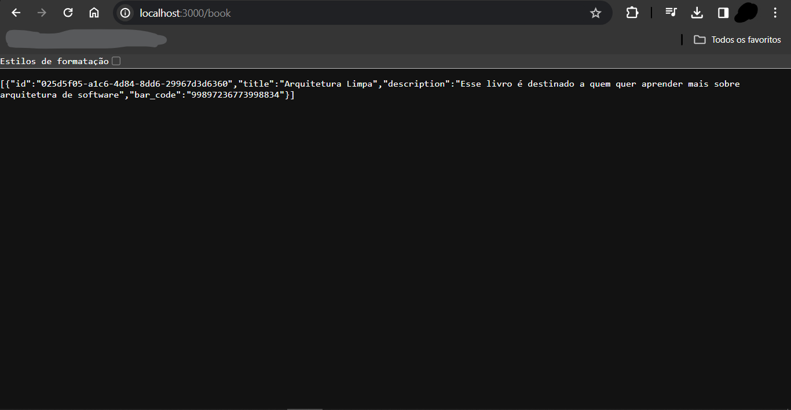
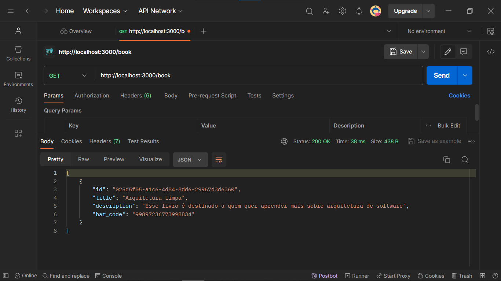

# CRUD DE LIVROS COM NESTJS E PRISMA
👨‍🏫ESSE É UM CRUD QUE USA O SQLITE COM PRISMA E API RESTFUL.

 <br> 
 <br> 
 <br> 

## DESCRIÇÃO:
Este aplicativo é um serviço RESTful para gerenciar livros. Ele usa o framework Nest.js e o Prisma com SQLite como banco de dados. Você pode adaptá-lo e estendê-lo conforme necessário para atender aos requisitos específicos do seu projeto.

## FUNCIONALIDADES:
1. **Criar Livro**: 
   - Método: `POST`
   - Rota: `/book`
   - Descrição: Cria um novo livro com os dados fornecidos.
   - Parâmetros do Corpo da Requisição: Um objeto contendo os dados do livro, conforme especificado pela interface `BookDTO`.

2. **Listar Todos os Livros**: 
   - Método: `GET`
   - Rota: `/book`
   - Descrição: Retorna uma lista de todos os livros cadastrados.

3. **Atualizar Livro**:
   - Método: `PUT`
   - Rota: `/book/:id`
   - Descrição: Atualiza os dados de um livro existente com o ID especificado.
   - Parâmetros da URL: `id` (ID do livro a ser atualizado)
   - Parâmetros do Corpo da Requisição: Um objeto contendo os dados atualizados do livro, conforme especificado pela interface `BookDTO`.

4. **Excluir Livro**:
   - Método: `DELETE`
   - Rota: `/book/:id`
   - Descrição: Exclui um livro existente com o ID especificado.
   - Parâmetros da URL: `id` (ID do livro a ser excluído)

## EXECUTANDO O PROJETO:
1. **Instalando as Depêndencias:**
   - Para instalar as dependências listadas no arquivo "package.json", você pode usar o comando `npm install` no terminal. Certifique-se de estar no diretório do seu projeto onde o arquivo "package.json" está localizado. O npm irá ler o arquivo "package.json" e instalar todas as dependências listadas nele. 

   - Aqui está o comando:

   ```bash
   npm install
   ```

2. **Subindo o Servidor:**
   - Para subir o servidor, no diretório do seu [projeto](./CODIGO/), digite o seguinte comando no Terminal/CMD:
   ```bash
   npm run start
   ```

   OU:

   ```bash
   npm run start:dev
   ```

3. **Uso das Rotas**:
   - Use um cliente HTTP (como Postman, Insomnia ou até mesmo o navegador) para enviar requisições HTTP para as rotas conforme descrito acima.
   - Por exemplo, para criar um novo livro, envie uma requisição POST para `http://localhost:3000/book` com os dados do livro no corpo da requisição.

4. **Manipulação dos Dados**:
   - As outras operações (listar, atualizar e excluir livros) você deve seguir um processo semelhante, utilizando as rotas e métodos HTTP apropriados.

## NÃO SABE?
- Entendemos que para manipular arquivos em `HTML`, `CSS` e outras linguagens relacionadas, é necessário possuir conhecimento nessas áreas. Para auxiliar nesse aprendizado, oferecemos cursos gratuitos disponíveis:
* [CURSO DE HTML E CSS](https://github.com/VILHALVA/CURSO-DE-HTML-E-CSS)
* [CURSO DE NESTJS](https://github.com/VILHALVA/CURSO-DE-NESTJS)
* [CURSO DE PRISMA](https://github.com/VILHALVA/CURSO-DE-PRISMA)
* [CURSO DE API REST](https://github.com/VILHALVA/CURSO-DE-API-REST)
* [CONFIRA MAIS CURSOS](https://github.com/VILHALVA?tab=repositories&q=+topic:CURSO)

## CREDITOS:
- [PROJETO CRIADO PELO "danileao"](https://github.com/danileao/youtube-nestjs-prisma)
- [VEJA O VIDEO DESSE PROJETO](https://youtu.be/0Idug0e9tPw?si=m96i4ViWv_BcqTGa)
- [PROJETO FEITO PELO VILHALVA](https://github.com/VILHALVA)


